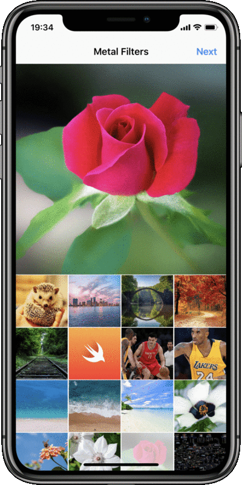

A demo using [MetalPetal](https://github.com/MetalPetal/MetalPetal) to implement all Instagram filters.

## Features

* Instagram like photo picker
* All Instagram filters
* Slider to control Strength of filters

## On-Working

* MTBasicAdjustFilter
* tint color ajustment
* tintHighlightsColor UI Control
* MTLocalLaplacianFilter
* MTFilterGroup
* Performance

## Requirements

* iPhone Device
* iOS 11.0+
* Xcode 9.0+

## License

MetalFilters is MIT-licensed. 

Filter Resources and Shaders copyright to Instagram. You can not use in your commercial apps.
